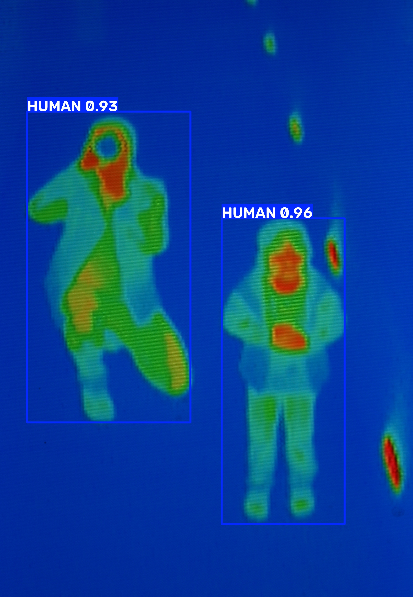
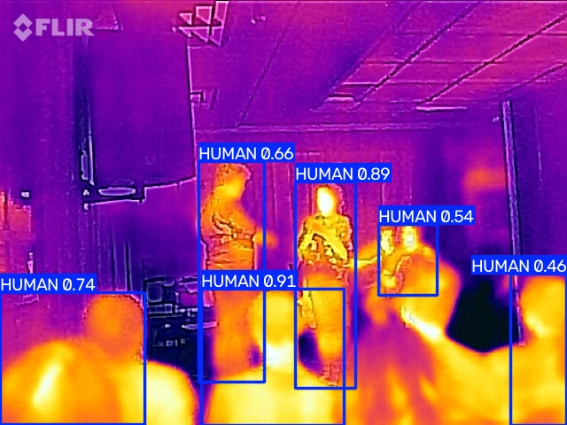
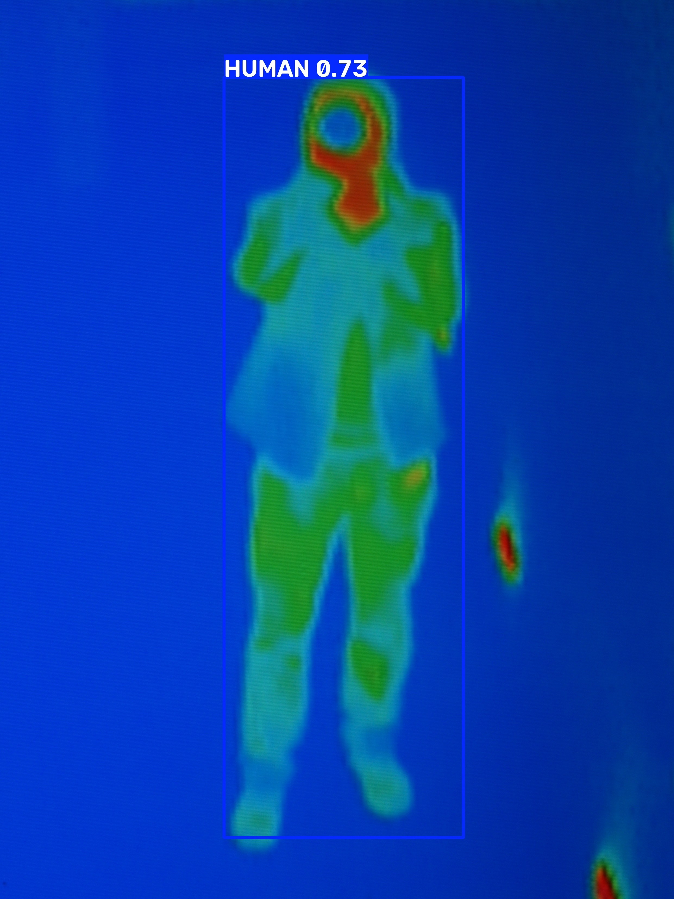

# 🌡️ Thermal-Human-Detection

Human detection in thermal imagery using a custom-trained YOLO model. Works on 📷 thermal images, 🎥 video files and 🔴 webcam input, with an optional fake-thermal mode for regular RGB cameras.


## ✨ Features

- Custom YOLO weights (`model.pt`) trained for a single `HUMAN` class in thermal images
- Image inference via `test_model.py` (folder or single image)
- Video and webcam inference via `test_video.py` with live display
- Fake-thermal mode (`COLORMAP_INFERNO`) to test the model on normal RGB video
- Annotated images and video saved automatically
- Sample detection results with bounding boxes in `demo_detections/`

## 🖼️ Detection Results





## 🧠 Model Details

- Task: detection (`task: detect`)
- Classes: 1 — `{0: HUMAN}`
- Input size: 640 (`imgsz`)
- Weight file: `model.pt` (6 MB, nano-scale)
- Base framework version at training: Ultralytics 8.0.206
- Confidence threshold used in scripts: 0.4
- Tested inference environment: Ultralytics 8.4.160, Torch 2.14.0, OpenCV 5.0.0.93

### How It Works

1. Load `model.pt` with `ultralytics.YOLO`
2. Image mode: run `model.predict` on a folder or file, save annotated copies to `outputs/`
3. Video mode: read frames with OpenCV, optionally convert RGB frames to fake-thermal palette, run per-frame prediction, write annotated video and show live window
4. Print per-image or per-frame human counts with confidence and box coordinates

## 📁 Project Structure

```
Thermal-Human-Detection/
├── test_model.py       # Image / folder inference
├── test_video.py       # Video / webcam inference
├── model.pt            # Custom trained weights (HUMAN)
├── demo_detections/  # Sample thermal images with predicted boxes
├── videos/             # Sample thermal videos
├── requirements.txt
├── .gitignore
├── README.md
├── LICENSE
├── outputs/            # Generated output (not tracked)
└── video_outputs/      # Older sample outputs (not tracked)
```

| Script | Usage |
|--------|-------|
| `test_model.py [image]` | No argument runs on `demo_detections/`, or pass a single image path |
| `test_video.py <source> [fake]` | `source` is a video file or `0` for webcam, `fake` enables fake-thermal conversion |

## 🚀 Installation

### Prerequisites

- Python 3.10 or newer
- Git
- Windows, macOS or Linux
- Optional: webcam for live mode

### Setup

```powershell
git clone https://github.com/mehtadevansh736-a11y/Thermal-Human-Detection.git
cd Thermal-Human-Detection

python -m venv venv
.\venv\Scripts\activate

pip install --upgrade pip
pip install -r requirements.txt
```

macOS / Linux:

```bash
git clone https://github.com/mehtadevansh736-a11y/Thermal-Human-Detection.git
cd Thermal-Human-Detection

python3 -m venv venv
source venv/bin/activate

pip install --upgrade pip
pip install -r requirements.txt
```

## 🎮 Usage

Test on the included sample images:

```powershell
python test_model.py
python test_model.py demo_detections/thermal_person_01.jpg
```

Test on video:

```powershell
python test_video.py videos/thermal_short.mp4
python test_video.py videos/thermal_test.mp4
```

Live webcam:

```powershell
python test_video.py 0
```

Fake-thermal mode for a normal RGB video or webcam (converts frames with `COLORMAP_INFERNO` before inference):

```powershell
python test_video.py myvideo.mp4 fake
python test_video.py 0 fake
```

Press Q in the video window to quit. Annotated video is written to `outputs/video_output.mp4`.

## 📊 Sample Output

```text
Model: model.pt
Source: demo_detections
demo_detections\thermal_person_01.jpg -> 2 HUMAN(s)
  conf=0.96 box=[[x1, y1, x2, y2]]
  conf=0.93 box=[[x1, y1, x2, y2]]

Saved to: outputs
```

## 📦 Dependencies

| Package | Tested Version | Purpose |
|---------|----------------|---------|
| ultralytics | 8.4.160 | YOLO model loading and inference |
| opencv-python | 5.0.0.93 | Video capture, display, fake-thermal colormap |
| torch | 2.14.0 | Deep learning backend |
| torchvision | 0.29.0 | Vision utilities |
| numpy | 2.5.1 | Array operations |
| pillow | 12.3.0 | Image I/O |

Install with `pip install -r requirements.txt`. GPU users can install the CUDA build of torch from https://pytorch.org/get-started/locally/.

## 🛠️ Troubleshooting

| Issue | Fix |
|-------|-----|
| `Cannot open: <source>` | Check the video path, keep the file inside the project folder or pass the full path |
| Webcam shows black or fails | Close apps using the camera, try index `1`, check OS camera privacy settings |
| Video window does not close | Press Q while the OpenCV window is focused |
| `ModuleNotFoundError` | Activate the virtual environment and reinstall with `pip install -r requirements.txt` |
| Low confidence / missed detections | Thermal contrast varies by camera; try the `fake` flag only for RGB input, not for real thermal footage |

## 🙏 Acknowledgements

- [Ultralytics](https://github.com/ultralytics/ultralytics) for the YOLO framework
- [PyTorch](https://pytorch.org/) for the backend
- [OpenCV](https://opencv.org/) for video handling
- Sample thermal photos 01 and 03 by Böhringer Friedrich, via [Wikimedia Commons](https://commons.wikimedia.org/wiki/Category:Thermal_images_of_people) (CC BY-SA 2.5); sample photo 02 by David Skinner, via Wikimedia Commons (CC BY 2.0)

## 📄 License

MIT License. See `LICENSE`.

## 👨‍💻 Author

Devansh Mehta — [@mehtadevansh736-a11y](https://github.com/mehtadevansh736-a11y)
